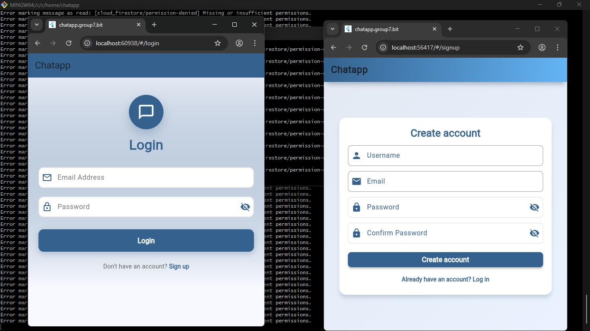
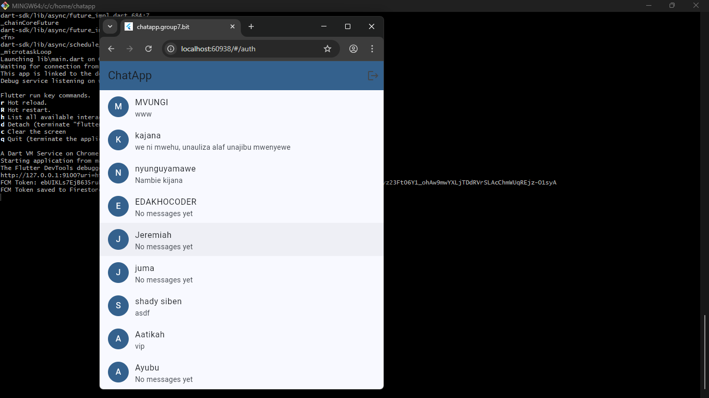
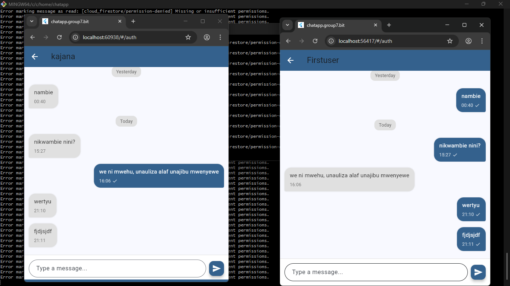
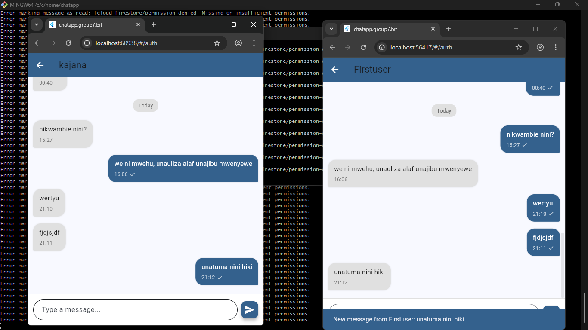

@GEOFREY JUMA KANDEA 
NIT/BIT/2023/2243 
# ChatApp

A simple chat application built with **Flutter** and **Firebase**
## Overview

ChatApp is a basic chat application designed to learn Flutter development with Firebase backend services.

## Features

1. **Authentication** - User signup and login with Firebase Authentication


2. **See Other Users** - View list of all registered users


3. **Send and Receive Messages** - Real-time messaging between users using Cloud Firestore


4. **Get Notifications** - Receive push notifications for new messages using Firebase Cloud Messaging


## Technology Stack

- **Flutter**: Cross-platform development
- **Dart**: Programming language
- **Firebase Authentication**: User login/signup
- **Cloud Firestore**: Store messages and user data
- **Firebase Cloud Messaging (FCM)**: Push notifications

## Quick Start

### 1. Setup Firebase
- Create a project at [firebase.google.com](https://firebase.google.com)
- Enable Firebase Authentication (Email/Password)
- Create a Cloud Firestore database
- Enable Cloud Messaging

### 2. Install Dependencies
```bash
flutter pub get
```

### 3. Run the App
```bash
flutter run
```

## Project Structure

```
lib/
├── main.dart
├── models/
|   ├── chat_model.dart
|   ├── message_model.dart  
|   └── user_model.dart
├── screens/
|   ├── auth/
|   |   ├── login.dart
|   |   └── signup.dart
|   |
|   ├── chat/
|   |    └── chat.dart
|   ├── home/
|   |    └── users.dart   
|   └──splash.dart
├── services/
|   ├── auth_service.dart
|   ├── chat_service.dart 
|   ├── user_service.dart
|   └── notification_service.dart
├── theme/
|   ├── app_colors.dart
└── widgets/
|    └── logout_button.dart
|
└── firebase_options.dart
```

## Collaborators up to (11:00AM, 19 feb 2026)
 
|      Full name    |      Reg number   | GitHub username      | Branchname |
| ------ | -------- | ------- | ------- | 
|  REVOCATUS KAJANA | NIT/BIT/2023/2330 | revocajana           | revocajana |
|  COLETHA   PAULO  | NIT/BIT/2023/2089 | colethapaulo         | coletha    |
|  WAHABI   BUKURU  | NIT/BIT/2023/2115 | wahabisaidy5-png     | wahabi     |
|  FATUMA   YUSUPH  | NIT/BIT/2023/2224 | fatmasongoro         |  fatma     |
|  JEREMIA  MASABURI| NIT/BIT/2023/2041 | Jeremiah-Romanus     |  romanus   |
| ASTERIA MWALYENGA | NIT/BIT/2023/2046 | asteriapascal284-alt |  terry     |
| AYUBU   MSOKOLO   | NIT/BIT/2023/2225 | AYOUB-255            |  ayubu     |
| FLORIDA   MAYALLA | NIT/BIT/2023/2208 | Frolidanicas         |  nicas     |
| GEOFREY   KANDEA  | NIT/BIT/2023/2243 | Slaughter-69         |  slaughter |
| EMANUEL   DAKHO   | NIT/BIT/2023/2158 | edakhocoder          |  edakho    |
| SHADRACK MWASAMYA | NIT/BIT/2023/2199 | mwamkakilwasiben-png |  siben     |
| DIDAS  MALISAWA   | NIT/BIT/2023/2240 | ziongzou8            |  ziong     |
| AVINUS R ADABERT  | NIT/BIT/2023/2351 | adabertavinus-alt    |  avy       |
| FRANK  GODFREY    | NIT/BIT/2023/2328 | FRANK-GODFEYai196    |  frankich  |
| WILIAM   MVUNGI   | NIT/BIT/2023/2226 | wiliammvungi95-web   |  mvungi    |


This is a learning project to understand:
- Firebase authentication with Flutter
- Real-time database operations with Firestore
- Push notifications with Firebase Cloud Messaging
- State management in Flutter
